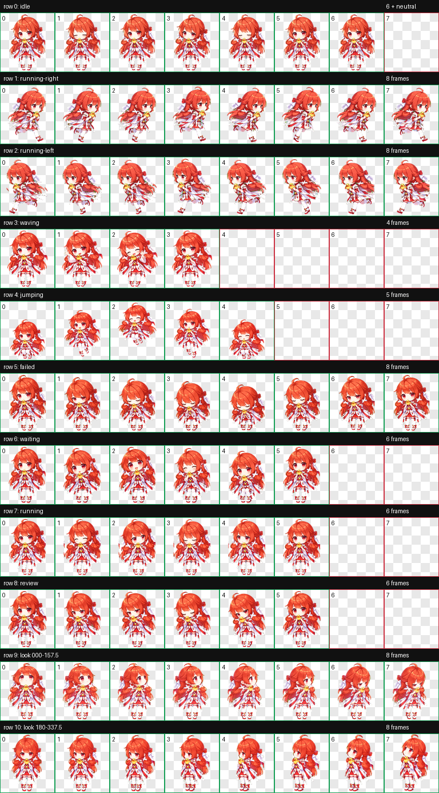

# 绘梨衣桌面宠物

一个轻量、透明背景、始终置顶的 Windows 动态桌宠。绘梨衣拥有 73 帧动画、16 个视线方向、随机小动作和单实例保护；她作为独立进程运行，退出 Codex / GPT 后也会继续留在桌面。



| 待机 | 挥手 | 跳跃 |
| --- | --- | --- |
|  |  |  |

## 功能

- 透明无边框窗口，可自由拖动
- 视线会跟随附近的鼠标，共 16 个方向
- 挥手、跳跃、左右散步、等待、专注、检查、难过等动作
- 自动随机做小动作，可在右键菜单关闭
- 可切换始终置顶
- 单实例保护，重复启动也只出现一只
- 可选开机自启动，不依赖 Codex / GPT 持续运行
- 完全本地运行，不联网、不调用 API

## 环境要求

- Windows 10 或 Windows 11
- Python 3.10 或更高版本（从 [python.org](https://www.python.org/downloads/windows/) 安装时请勾选 **Add Python to PATH**）

## 快速开始

1. 点击 GitHub 页面右上方 **Code → Download ZIP**，解压到一个长期保留的目录。
2. 双击 `install.cmd`。它会安装 Pillow、在桌面创建“绘梨衣”快捷方式并立即启动桌宠。
3. 以后双击桌面的“绘梨衣”，或双击目录中的 `start-erii.cmd` 即可启动。

也可以在 PowerShell 中手动运行：

```powershell
py -3 -m pip install -r requirements.txt
py -3 desktop_pet.py
```

## 操作方法

- **鼠标拖动**：移动绘梨衣
- **移动鼠标到她周围**：视线跟随鼠标方向
- **双击**：挥手
- **鼠标滚轮**：跳跃
- **右键**：打开完整动作菜单
- **右键 → 退出绘梨衣**：完全结束桌宠

右键菜单还可以触发左右散步、等待、专注、检查、难过、回到待机，并可切换“始终置顶”和“随机小动作”。

## 设置开机自启动

在解压后的目录空白处按住 Shift 并右键，选择“在终端中打开”，运行：

```powershell
powershell -ExecutionPolicy Bypass -File .\install-autostart.ps1
```

脚本会创建当前用户的 Windows 登录计划任务 `EriiDesktopPet`，并立即启动桌宠。关闭 Codex / GPT 不会影响它。

如需取消开机自启动：

```powershell
powershell -ExecutionPolicy Bypass -File .\uninstall-autostart.ps1
```

取消自启动不会删除本目录中的任何文件；当前运行的绘梨衣可以通过右键菜单退出。

## 项目文件

- `desktop_pet.py`：桌宠程序源码
- `spritesheet.webp`：8×11 动画图集
- `preview.png`、`*.gif`：说明文档预览图
- `install.cmd`：安装依赖并启动
- `start-erii.cmd`：普通启动器
- `launch-hidden.vbs`：无命令行窗口启动器
- `create-desktop-shortcut.ps1`：创建桌面快捷方式
- `install-autostart.ps1` / `uninstall-autostart.ps1`：管理开机自启动

## 验证资源

```powershell
py -3 desktop_pet.py --self-test
```

成功时会输出 `"ok": true`，并确认 73 个动画帧均可读取。

## 说明

代码采用 MIT License。角色形象及美术素材仅用于学习、交流与个人桌面使用；相关角色权利归其权利人所有。
